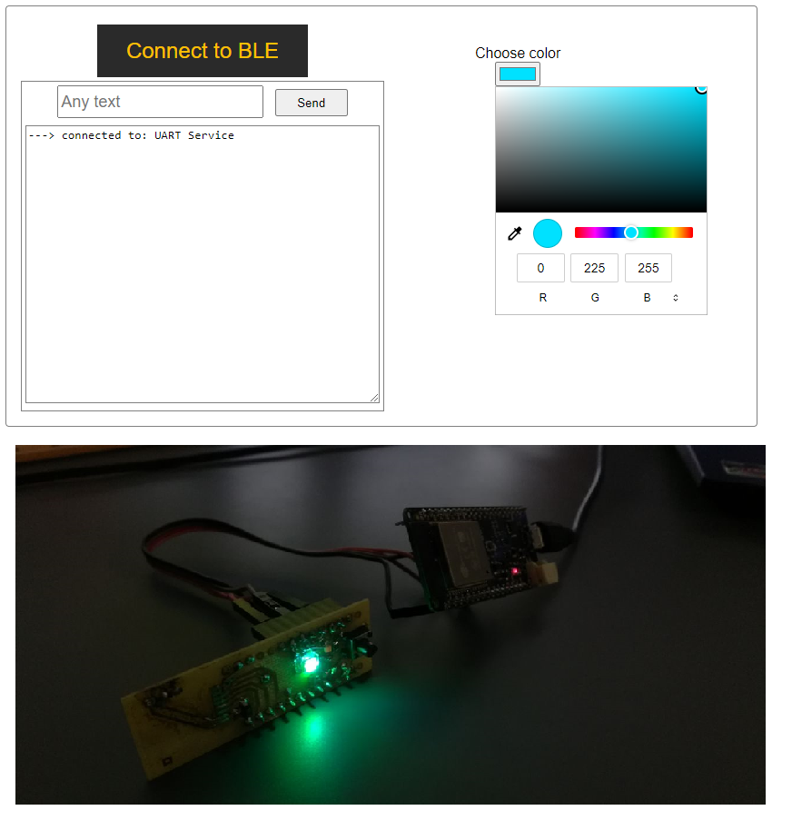

Bluetooth example using web bluetooth api.

With this application you can connect your ESP32 board to Google Chrome via Bluetooth and control the color of LED by using a color picker on the web page.

How to use:

1. Flash your ESP32 board and connect the RGB LED as described in the BLE_uart.ino file
2. Open index.html in Chrome browser
3. Click the "Connect to BLE" button
4. Now you can open the color picker and choose the color, the LED will change its glow accordingly
5. Additionally, text data can be sent via the input form  

Articles used: 

https://medium.com/@gerybbg/web-bluetooth-by-example-6d200fa9a3ed

https://habr.com/ru/post/414357/
